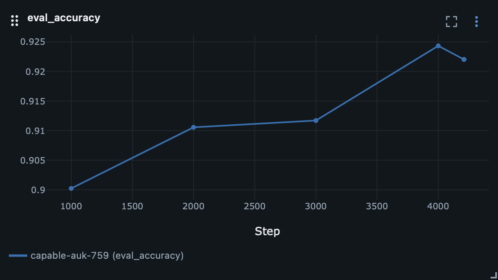
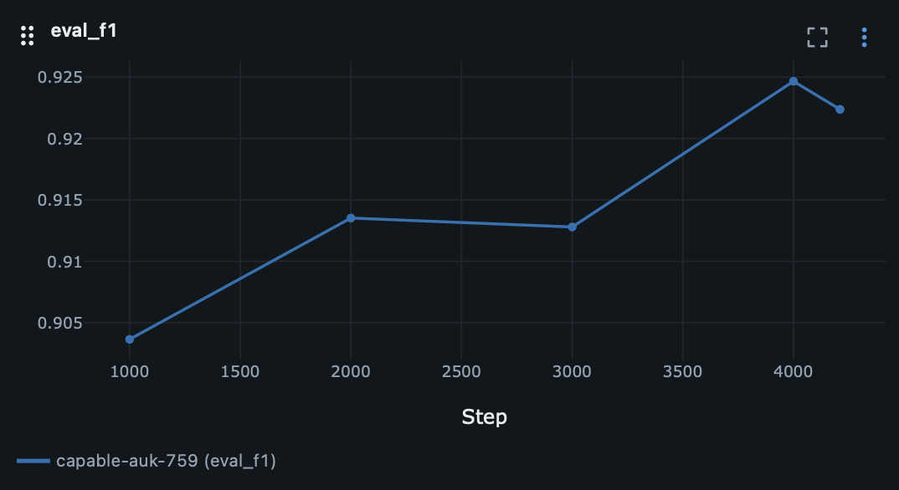
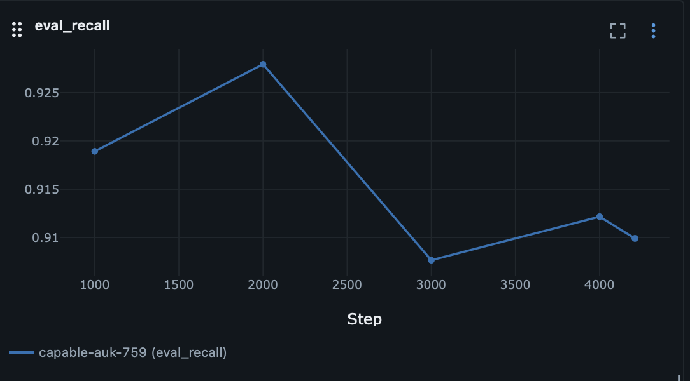
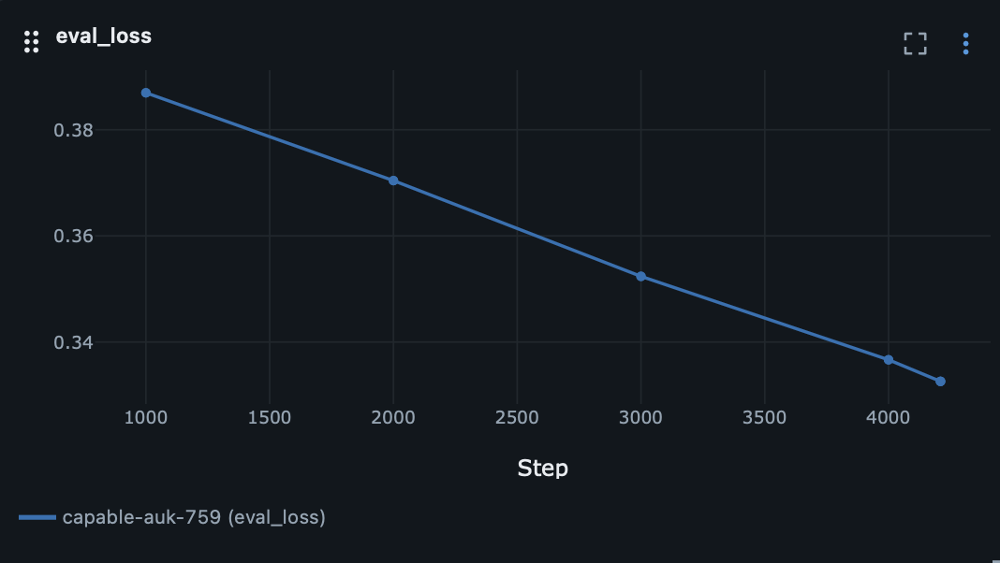
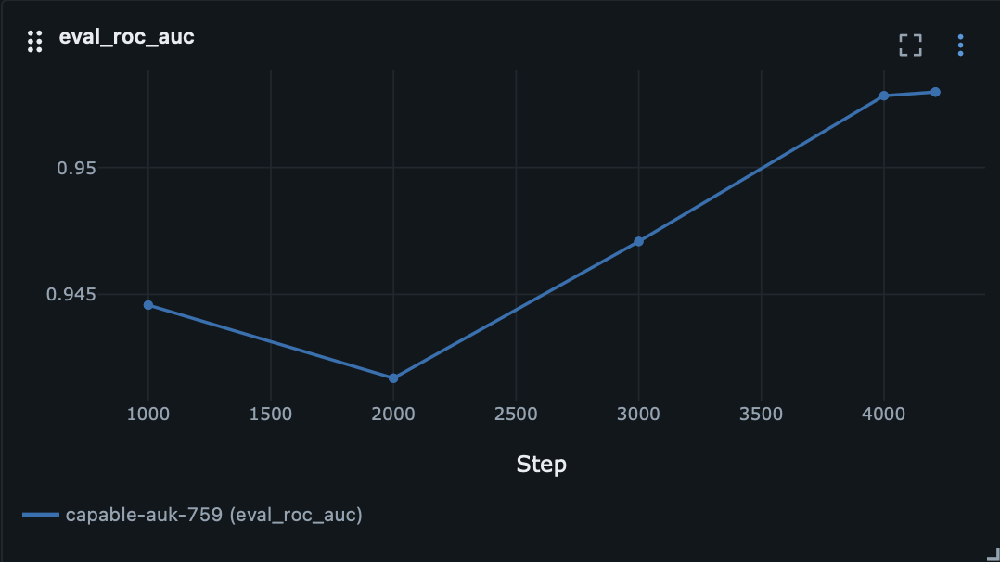
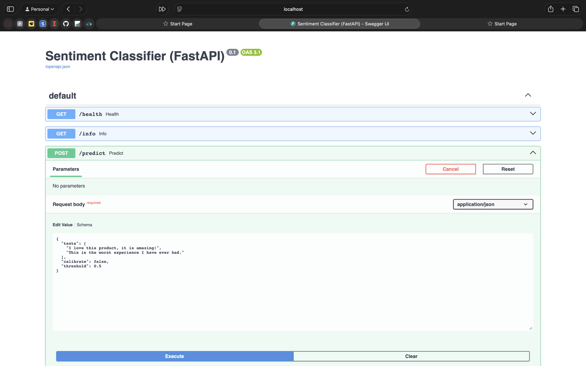
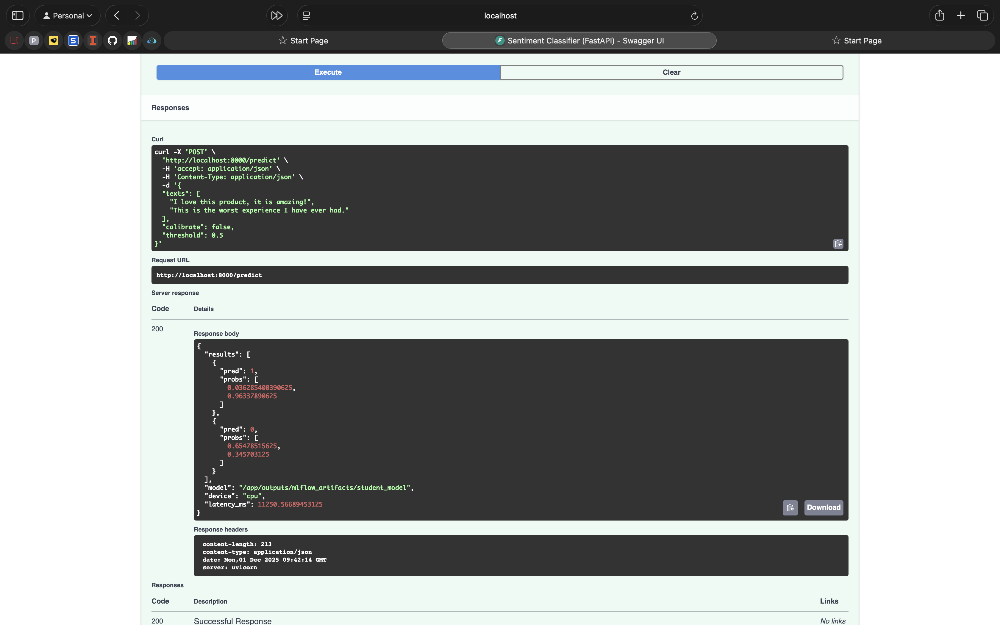

# **LlamaDistill-Sentiment (LLM-NEO v2)**

### *Efficient Knowledge Distillation + LoRA + Full Deployment Stack*


*Figure: LLM-NEO framework combining Knowledge Distillation (KD) and Low-Rank Adaptation (LoRA).*

---

# **📌 Overview**

**LlamaDistill-Sentiment (LLM-NEO v2)** is a complete **end-to-end machine learning system** for distilling a large LLM (Meta-Llama-3-8B) into a compact, efficient student model (Llama-3.2-1B) using:

* **Knowledge Distillation (KD)**
* **LoRA parameter-efficient fine-tuning**
* **MLflow experiment tracking**
* **FastAPI inference server**
* **Dockerized production deployment**

The result is a **high-accuracy**, **low-latency**, and **lightweight** sentiment classifier suitable for real-time ML applications.

---

# **📁 Project Structure**

```
LLMNEO_U
├── outputs/
│   ├── distilled-llama-sst2/
│   └── mlflow_artifacts/
│       ├── inference/
│       ├── mlruns/
│       └── student_model/
├── Results/
│   └── Results.ipynb
├── Snapshots/
│   ├── epoch_vs_steps.png
│   ├── eval_acc_vs_steps.png
│   ├── eval_f1_vs_steps.png
│   ├── eval_loss_vs_steps.png
│   ├── eval_prec_vs_steps.png
│   ├── eval_rec_vs_steps.png
│   ├── eval_rocauc_vs_steps.png
│   ├── Sentiment_classifier_predict_docs.png
│   └── Sentiment_classifier_predict_result.png
├── src/
│   ├── api.py
│   ├── inference.py
│   ├── mlflow_utils.py
│   ├── schemas.py
│   ├── training.py
│   └── utils.py
├── Visualisation/
│   └── mlflow_visualize.ipynb
├── docker-compose.yml
├── Dockerfile
└── requirements.txt
```

---

# **🧠 Methodology & Mathematical Foundations**

This project implements **Knowledge Distillation (KD)** + **LoRA** to transfer semantic knowledge from the teacher to the student.

## **1. Cross-Entropy Loss (Supervised Learning)**

For ground-truth label ( y ) and student logits ( s ):


---

## **2. Soft Targets (Teacher Output)**

Teacher logits ( t ) are softened using temperature ( T ):


Student soft predictions:


---

## **3. KL Divergence for Distillation**


Temperature (T > 1) smooths the distribution → softer gradients → better transfer of teacher information.

---

## **4. Combined Distillation Objective**


---

## **5. LoRA: Low-Rank Parameter Efficient Fine-Tuning**

Instead of updating full weights (W), we approximate the update:


LoRA update rule:


LoRA Benefits:

* Trains <0.1% of weights
* Memory efficient
* Excellent for on-device or low-resource environments

---

# **📊 MLflow Integration (Experiment Tracking)**

MLflow automatically logs:

* Loss curves
* Accuracy / precision / recall / F1 / ROC-AUC
* Confusion matrices
* Hyperparameters
* Artifacts (plots, model weights, predictions)
* Dockerized inference logs

Directory:

```
outputs/mlflow_artifacts/mlruns/
outputs/mlflow_artifacts/inference/
```

---

# **📈 Training Visualizations**

### **Epoch vs Steps**


### **Accuracy**



### **F1 Score**



### **Precision**


### **Recall**



### **Loss Curve**



### **ROC-AUC**



---

# **📦 Training Details**

### **Hyperparameters**

| Parameter            | Value |
| -------------------- | ----- |
| Epochs               | 1     |
| Batch Size           | 16    |
| Learning Rate        | 5e-5  |
| LoRA Rank (`r`)      | 4     |
| LoRA Alpha (`alpha`) | 8     |
| KD Temperature       | 2.0   |
| Loss Mix (α)         | 0.5   |

---

# **📊 Training Results**

| Train Loss | Epoch  | Step | Eval Loss | Accuracy | F1     | Precision | Recall | ROC-AUC |
| ---------- | ------ | ---- | --------- | -------- | ------ | --------- | ------ | ------- |
| 0.3856     | 0.2375 | 1000 | 0.3681    | 0.9243   | 0.9273 | 0.9073    | 0.9482 | **—**   |
| 0.3681     | 0.4751 | 2000 | 0.3634    | 0.9266   | 0.9297 | 0.9077    | 0.9527 | **—**   |
| 0.3648     | 0.7126 | 3000 | 0.3599    | 0.9346   | 0.9366 | 0.9253    | 0.9482 | **—**   |
| 0.3662     | 0.9501 | 4000 | 0.3580    | 0.9278   | 0.9310 | 0.9062    | 0.9572 | **—**   |

---

# **🧪 Inference Visualization**

### **FastAPI Docs**



### **Prediction Result**



---

# **🚀 FastAPI Inference Server**

Run locally:

```bash
uvicorn src.api:app --host 0.0.0.0 --port 8000
```

Endpoints:

* `/` homepage
* `/health`
* `/info`
* `/predict`

---

# **🐳 Docker Deployment**

### Build & Run

```bash
docker compose up --build
```

### Exposed Services

| Service     | Port     |
| ----------- | -------- |
| FastAPI API | **8000** |
| MLflow UI   | **5001** |

---

# **📮 Example Prediction**

Request:

```json
{
  "texts": ["I loved the film!", "This was terrible."],
  "calibrate": false,
  "threshold": 0.5
}
```

Response:

```json
{
  "results": [
    {"pred": 1, "probs": [0.03, 0.96]},
    {"pred": 0, "probs": [0.65, 0.34]}
  ],
  "model": "student_model",
  "device": "cpu",
  "latency_ms": 5120.80
}
```

---

# **🏁 Conclusion**

This repository demonstrates a complete sentiment classification pipeline using:

* Efficient KD + LoRA training
* MLflow experiment tracking
* Docker deployment
* FastAPI real-time inference
* Full visualization and reproducibility


---
